# 烤肉工房 · 图解使用手册

[返回项目首页](../README.md)

这份手册按第一次使用的顺序演示。截图来自独立的 **32 秒合成演示项目**；测试画面、示例字幕和手动候选只用于说明按钮，不是直播素材，也不是 ASR、翻译或自动选片的效果评测。图片为 Chromium 重新渲染的 2× 像素无损 PNG；点击图片可查看原图。功能窗口单独取景，方便看清按钮和文字。

## 功能导航

[1. 安装与启动](#start) · [2. 工作台](#workspace) · [3. 导入视频](#import) · [4. 安装模型](#models) · [5. 找片与术语](#highlights) · [6. 日语识别](#asr) · [7. 中文初译](#translation) · [8. 校对打轴](#timing) · [9. 角色配色](#speakers) · [10. 多段拼接](#assembly) · [11. 多个切片](#clips) · [12. 导出](#export) · [13. 常见问题](#faq)

<a id="start"></a>
## 1. 安装与启动

**需要：Apple Silicon Mac（M1 或更新）、建议 16 GB 内存、Python 3.12 / 3.13、首次安装可联网。** 目前没有 Windows 安装包，也没有打包成免安装的 `.app`。

1. 在 GitHub 仓库首页点击绿色 **Code → Download ZIP**，解压到一个准备长期保存的位置。
2. 打开 macOS「终端」，输入 `cd `（末尾有空格），把解压后的文件夹拖进终端，再按回车。
3. 输入 `bash scripts/setup.sh` 并回车，等待出现安装完成。依赖安装在项目内，不需要自己移动文件。
4. 输入 `.venv/bin/python scripts/launch.py` 启动；以后可以双击 `启动烤肉工房.command`。
5. 浏览器会打开 `http://127.0.0.1:8765`。先点击 **体验演示项目**，可以不下载模型就练习编辑和导出。

若终端提示找不到 Python，先安装适用于 Apple Silicon 的 Python 3.12 / 3.13，再重新执行安装脚本。若 `.command` 不能双击运行，使用上述终端启动方式。关闭标签页不会结束后台服务；结束工作后运行 `停止烤肉工房.command`。

<a id="workspace"></a>
## 2. 先认识工作台

[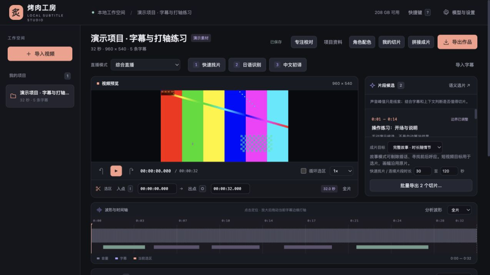](images/overview.png?raw=1)

| 区域 | 在这里做什么 |
| --- | --- |
| 左侧「我的项目」 | 一场原始直播对应一个项目；点名称切换 |
| 顶部工具栏 | 项目资料、角色配色、我的切片、拼接、导出 |
| 「快速找片 → 日语识别 → 中文初译」 | 获取候选、带时间的日文字幕、中文草稿 |
| 中间播放器 | 试听、变速、循环；下方填写当前选区入点 / 出点 |
| 右侧「片段候选」 | 看推荐理由、选择故事目标、保存候选 |
| 波形与时间轴 | 定位原片时间，放大后调整字幕边缘 |
| 下方字幕工作台 | 左边时间和角色，中间日文，右边中文，末列校对标记 |

**三个容易混淆的概念：** “当前选区”是原片的一段连续时间；“拼接清单”是按播放顺序排列的多个区间；“我的切片”是已经命名保存、能单独导出的作品。它们都引用同一份原片，无需复制整场直播。

<a id="import"></a>
## 3. 导入本地视频或 YouTube 回放

[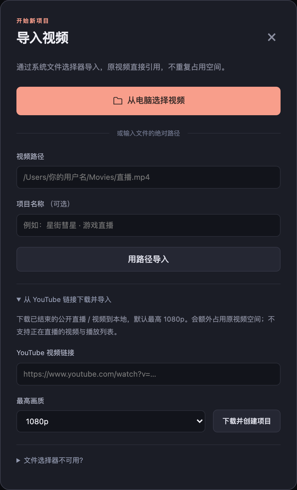](images/import.png?raw=1)

**已有本地文件：** 左侧 **导入视频 → 从电脑选择视频**。选完后会创建项目并分析波形。也可在「视频路径」填绝对路径，点击「用路径导入」。直接引用原文件，不额外复制；之后不要移动或删除原片。

**使用链接：** 展开 **从 YouTube 链接下载并导入**，粘贴单个公开回放链接，选择最高画质，再点「下载并创建项目」。下载完成后自动创建项目。该功能需要 Node.js 和可访问 YouTube 的网络；不支持正在直播的视频或播放列表。

想出 1080p，请在这里选择 1080p，并在导入完成后检查项目标题下实际显示的宽高。网站没有该画质时不能凭空获得高清。下载占用额外磁盘空间，失败时可以改为用本地视频导入。

<a id="models"></a>
## 4. 安装本地模型

[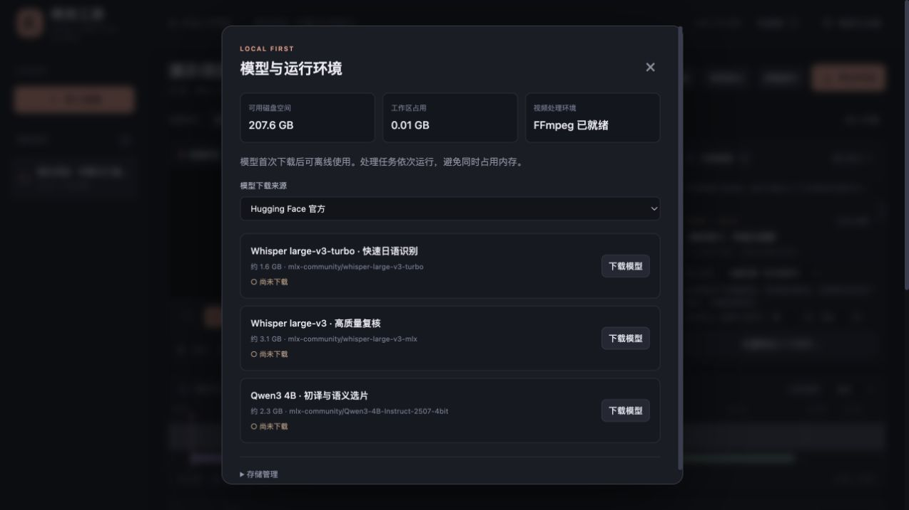](images/models.png?raw=1)

1. 点击右上角 **模型与设置**。
2. 先下载 **Whisper large-v3-turbo**，用于日语识别。
3. 再下载 **Qwen3 4B**，用于中文初译和语义选片。
4. 等待任务完成、界面显示已安装，再执行对应功能。**large-v3** 是可选模型，难句需要复核时再安装。

默认下载来源为 Hugging Face。确有网络需要时可自行切换界面提供的镜像。首次下载之后，本地推理使用缓存模型；任务按队列依次运行，避免同时占满内存。仅编辑已有字幕、做拼接和导出不要求先安装这两个模型。

<a id="highlights"></a>
## 5. 找到值得剪的内容，并设置术语

在工作台顶部选择直播模式：综合、游戏、杂谈 / 联动、歌回 / 演唱会。点 **快速找片**，等待右侧出现候选，逐个点击试听。它主要依据声音和已有字幕提供线索，**候选分数不是“精彩程度正确率”**。

有字幕以后，可在右侧选成片目标，再点 **语义选片**：

| 目标 | 适合的任务 |
| --- | --- |
| 完整故事 | 想把事情说完整；允许多段拼接和更长时长 |
| 短视频 | 软性偏好 1–2 分钟；不会自动裁成竖屏 |
| 连续片段 | 按最短 / 最长秒数，找连续区间 |

如果只识别了几分钟，语义选片也只能理解已有字幕的部分。想找整场前后呼应，先识别或导入相关范围的字幕。试听确认后点 **保存为切片**，也可以点 **加入拼接** 再调整。

[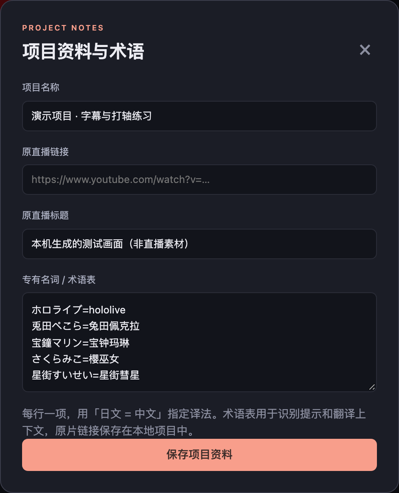](images/glossary.png?raw=1)

运行识别或翻译前，可点顶部 **项目资料**，填写原直播标题和术语表，例如：

```text
天音かなた = 天音彼方
スパチャ = Superchat
```

每行一个词，点击「保存项目资料」。标题和术语帮助模型理解上下文，但不能保证人名、梗和省略句完全正确。

<a id="asr"></a>
## 6. 日语识别：先自动打好基础时间轴

[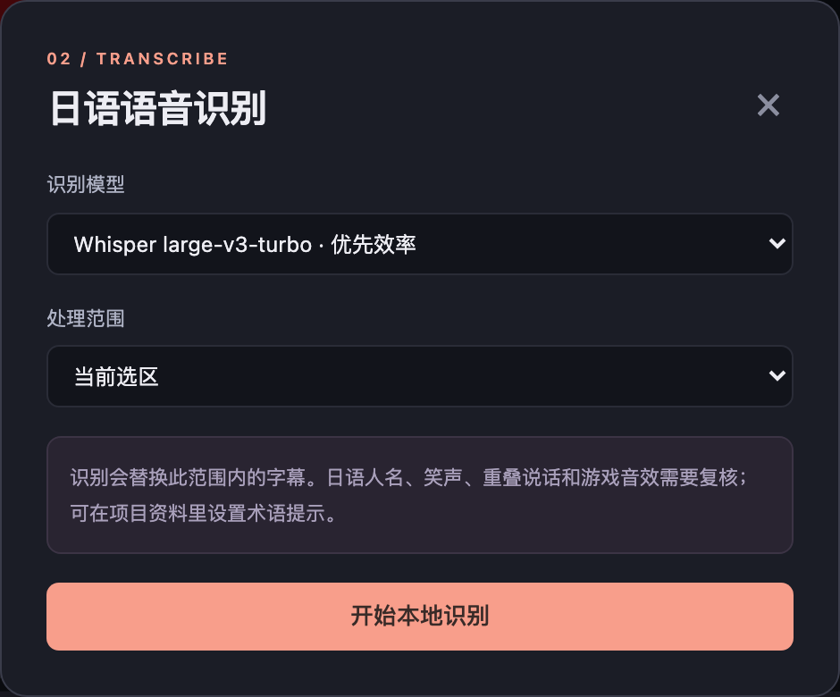](images/asr.png?raw=1)

1. 在播放器下方填入点、出点，或者在播放时按 **I / O**，选出准备处理的范围。
2. 点击 **日语识别**。默认选 turbo，处理范围选「当前选区」，先小范围试用。
3. 点击 **开始本地识别**。完成后字幕表会出现日文、每句的 IN / OUT 和需要复核的提示。
4. 需要全局找片时，再选择「整个视频」识别。长直播耗时取决于设备和素材。

**通常不必从零打轴：** ASR 已给每句设置起止位置，你可以直接在对应中文栏翻译。笑声、重叠讲话、音乐和自动断句会影响边界，需要听校。

识别会替换处理范围内的字幕。已经校对过的范围，重新识别前先导出字幕备份。对于拼接故事，应分别在相关原片选区识别，或直接识别整片。

已有字幕文件时，可使用流程栏右侧 **导入字幕**，按窗口选择语言并导入 SRT，再核对它是否采用原片时间。不要把从 0 开始的成片字幕直接当作整场原片字幕导入。

<a id="translation"></a>
## 7. 中文初译与可选 API

[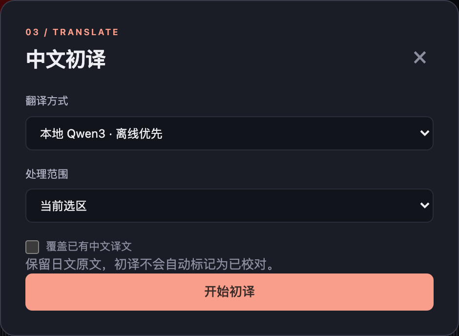](images/translation.png?raw=1)

1. 先完成日语识别或导入日文字幕，再点 **中文初译**。
2. 翻译方式选择「本地 Qwen3」，范围选择「当前选区」或「所有字幕」。
3. 默认不勾选「覆盖已有中文译文」，避免重新生成已经手工修改的中文。
4. 点击 **开始初译**，等待中文栏出现草稿，再逐句听校。

整片翻译会分组保存缓存；模型漏掉字幕或返回格式错误时，会自动缩小到每组 3 条、再到逐句补译。仍失败的句子保留原有中文或空白，任务会提示数量，其余译文正常保存。再次初译且不勾选覆盖，会只补齐空白；中断后也可用相同设置继续，复用已保存的分组缓存。

若想使用自己的服务，把翻译方式切换为「自己的 OpenAI 兼容 API」，填写 Base URL、模型名称和密钥。只在确实打算发送字幕给该服务时使用；密钥无需提交到 GitHub。初译不会自动把字幕标记为已校对。

<a id="timing"></a>
## 8. 逐句校对、修轴与整体偏移

**一句话被切成好几条？** 在字幕工具栏点「整理断句」。它按日语接续词和停顿推荐合并，默认最长 9 秒、52 个日文字、相邻停顿不超过 0.45 秒，参数可调。预览里的 `/` 表示原来的分界；取消勾选即可保留某组原断句，再点「应用勾选的断句」。操作保留逐词时间、中文和角色配色，可用「撤销」恢复。

勾选「应用后用本地模型重译合并过的字幕」可按新的完整句子重新初译，其余字幕不动。不勾选时，中文仅拼接，旧误译仍需校对。已校对字幕、明确不同的说话人和明显短回应会跳过；没有标说话人的联动仍可能误合并，请先试听。新 ASR 默认做同样的保守合并，可在识别窗口取消勾选，改成识别后逐组预览。断句整理不会修复听错的人名或凭空补齐漏词。

[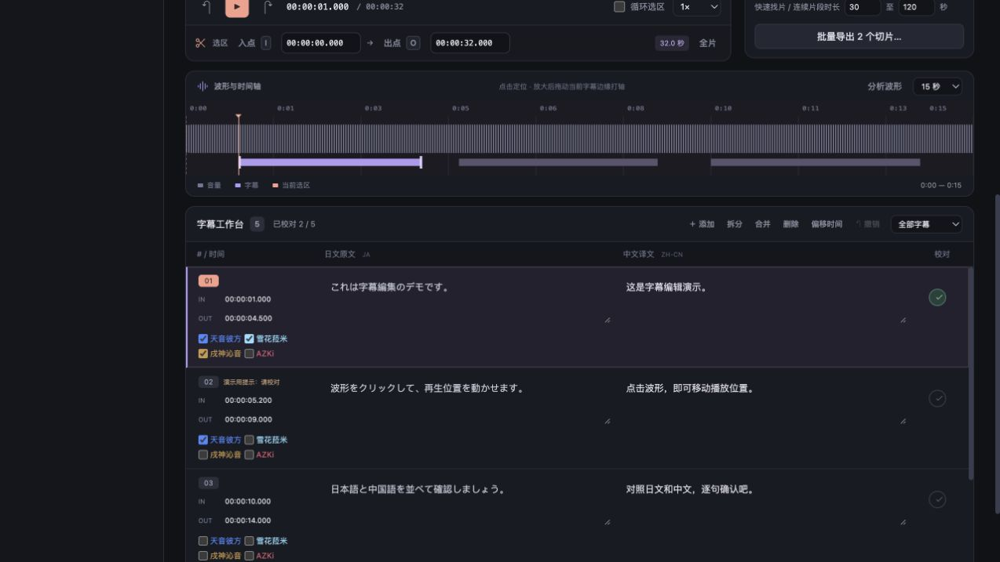](images/timing.png?raw=1)

**逐句校对：** 点击左侧字幕编号跳到句首 → 试听 → 修改中文栏 → 听清后点击最右侧校对标记。修改文字不会改变该句时间。窗口较宽时，可点击「专注校对」，集中显示播放器、时间轴和字幕。

**修一条字幕的起止：**

1. 点击该行选中字幕，时间轴缩放改为 **15 秒**。
2. 点击波形定位、用播放器慢速试听；选中字幕的两端可以拖动。
3. 也可直接编辑该行开始 / 结束时间。格式如 `00:01:23.450`。
4. 播放头到正确时刻时，点击该行 **IN / OUT**，或先退出文字输入框，再按 **Alt / ⌥ + I / O**。

**断句不对：** 选中该行，在需要断开的时间点点击「拆分」；要合并则选前一行点击「合并」。不同角色的两条字幕先统一说话人选择再合并。没有词级对齐时，拆分文字只是估算，请重新听校。误操作可用「撤销」。

**反复听难句：** 把播放器下方选区设置为这一句附近，勾选「循环选区」，速度选择 0.75× 或 0.5×。循环的是当前选区，并不会自动等于你选中的字幕行。

[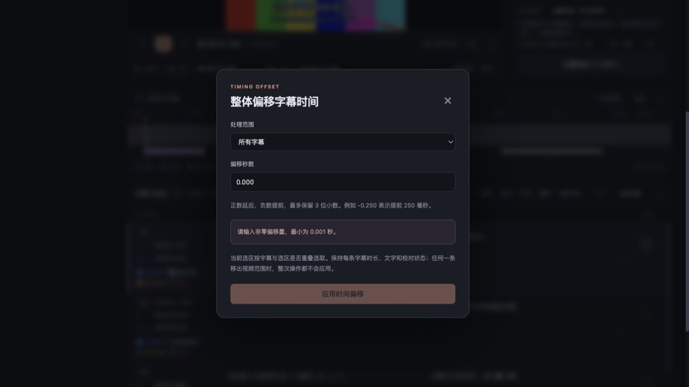](images/timing-offset.png?raw=1)

**整段字幕都偏晚 / 偏早：** 点击「偏移时间」，选所有字幕、当前选区或当前一条；填 `-0.250` 表示提前 250 毫秒，填 `0.250` 表示延后。应用后每句时长保持不变。如果任一字幕会超出原片边界，整次偏移不会执行。

保存状态位于顶部。自动保存显示「已保存」后再关闭页面；也可按 ⌘S。筛选框可只显示待校对字幕、当前选区或拼接清单覆盖的字幕。

<a id="speakers"></a>
## 9. 单人颜色与多人齐声

[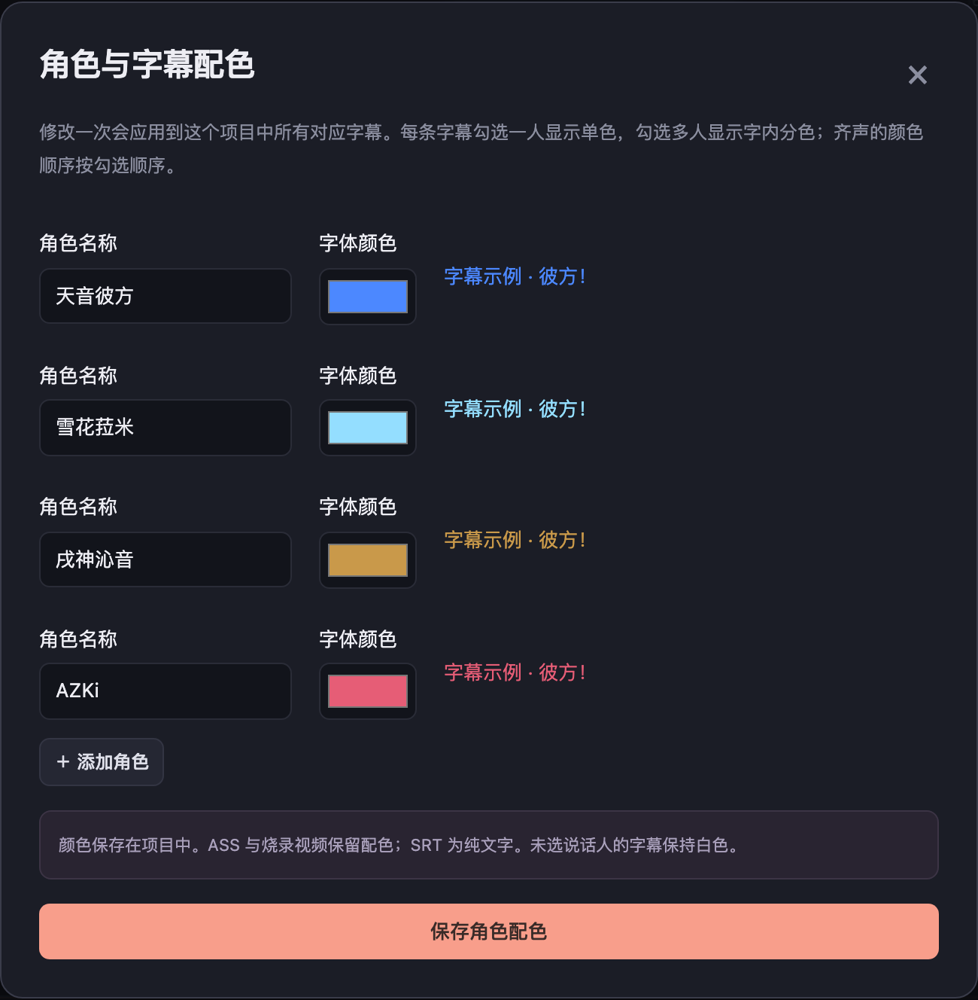](images/speakers.png?raw=1)

1. 点击顶部 **角色配色**，修改角色名和颜色，必要时点击「添加角色」。
2. 点击「保存角色配色」。返回字幕表，在每句时间框下勾选说话人。
3. 勾选一人使用单色，勾选多人时每个字内分成多个横向色带，适合齐声喊话。
4. 未选择角色的字幕保持白色；修改角色颜色会应用到项目里所有对应的字幕。

截图中的第一句已手动选择三人，可在播放器预览字内分色。软件目前**不会自动可靠辨认谁在讲话**，要由编辑者听校选择。SRT 不保存颜色；请导出 ASS 或「MP4 视频 + 烧录字幕」。

<a id="assembly"></a>
## 10. 去掉插话，把前后互动拼成一个故事

[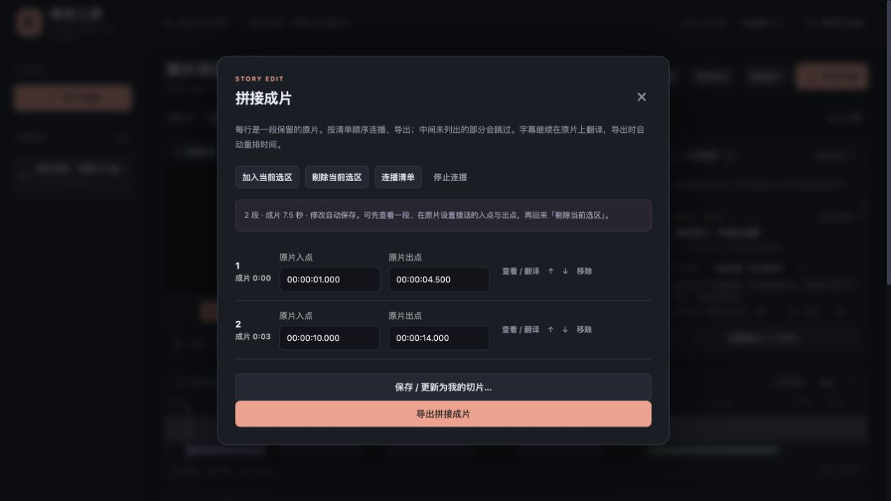](images/assembly.png?raw=1)

1. 在原片设置一段选区，打开 **拼接成片 → 加入当前选区**。
2. 回到原片，再选另一段，继续加入。每行是一段保留内容，按清单顺序导出。
3. 可以直接修改每行时间，用 **↑ / ↓** 调整顺序，或者「移除」不需要的段落。
4. 点击 **连播清单** 检查故事是否自然，再点 **保存 / 更新为我的切片**。

**例子：去掉 Superchat 插话。** 原本保留 `01:00–02:00`，中间 `01:20–01:35` 与话题无关：在原片把当前选区设为这 15 秒，回到清单点「剔除当前选区」，就会保留 `01:00–01:20` 和 `01:35–02:00`。

**例子：前后呼应。** 把前半场 `10:00–11:00` 的铺垫和后半场 `40:00–42:00` 的回应分别加入同一清单，连播确认信息足够，再保存成一部切片。

字幕始终按原片时间校对，导出时自动换算到拼接后的时间，不需要重新手工打轴。浏览器连播只用于近似预览，最终视频由 FFmpeg 生成。

<a id="clips"></a>
## 11. 一场直播保存多个独立切片

[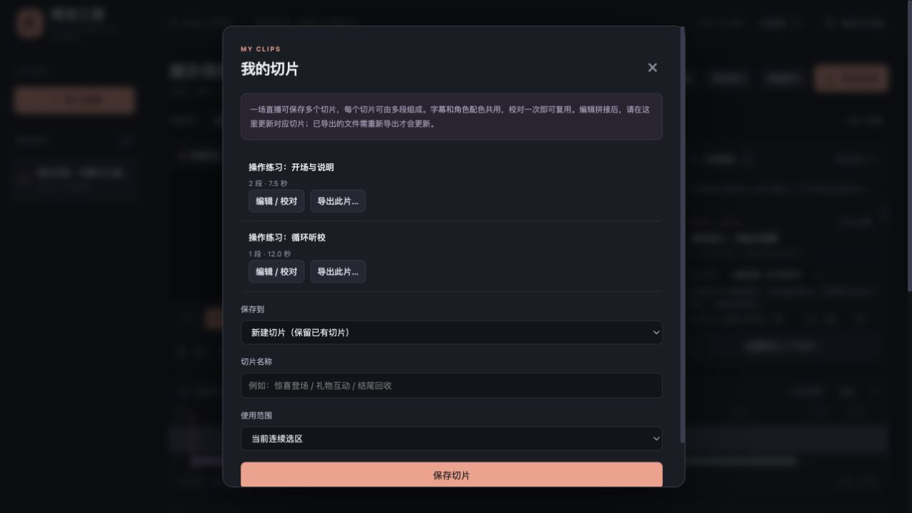](images/clips.png?raw=1)

1. 设置当前选区，或准备好拼接清单，再打开 **我的切片**。
2. 「保存到」选择 **新建切片（保留已有切片）**。
3. 填写名称，如“惊喜登场”；「使用范围」选当前连续选区或整个拼接清单。
4. 点击「保存切片」。换一段内容，再重复以上操作，就得到第二部、第三部作品。

**修改已有作品：** 在卡片点击「编辑 / 校对」，它的区间会载入拼接清单。修改后回到「我的切片」，确认「保存到」是要更新的那一部，再保存。若想保留长版并另存短版，要改选「新建切片」。

单个作品点击「导出此片」；全部作品点击「批量导出我的切片」。它们共用同一份原片字幕和角色配色，因此重叠对白的译文改一次即可复用。已生成的视频是文件快照，字幕修改后需要重新导出。

<a id="export"></a>
## 12. 导出字幕、带字幕视频与分辨率选择

[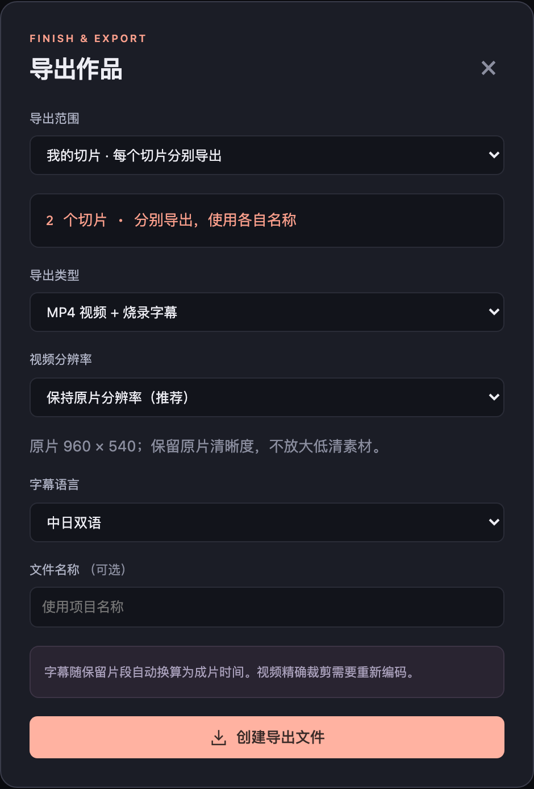](images/export.png?raw=1)

1. 点击顶部 **导出作品**，或从「我的切片」进入单片 / 批量导出。
2. 确认范围：当前连续选区、整份拼接清单（合成一部），或我的切片（每部独立输出）。
3. 根据用途选择格式：

| 格式 | 得到什么 | 常见用途 |
| --- | --- | --- |
| SRT | 时间和纯文字 | 备份译文、交给其他剪辑工具 |
| ASS | 带样式与角色颜色的字幕 | 在 Aegisub 等工具继续排版 |
| MP4 视频切片 | 裁剪后的视频，不烧录新增字幕 | 后续继续剪辑 |
| MP4 视频 + 烧录字幕 | 字幕直接绘制进画面 | 预览最终字幕效果、准备投稿 |

4. 视频分辨率默认「保持原片」。也可选择最高 720p、1080p 等，保持比例，不会放大低清原片。截图的 540p 演示素材即使选 1080p，也不会变成真实 1080p。
5. 选仅中文、中日双语或仅日文。单片可填写文件名；批量使用各作品名称。
6. 点击底部 **创建导出文件**（窗口较矮时向下滚动），等待任务完成。在导出文件区点击「下载文件」。

输出也保存在 `data/exports/<项目 ID>/`。视频旁另有原片链接和区间说明文本。投稿前仍需复核译文、节奏和素材许可；软件不会自动上传 B 站。

<a id="faq"></a>
## 13. 常见问题与备份

| 遇到的问题 | 怎么处理 |
| --- | --- |
| 没有候选 / 候选不精彩 | 先试听声音候选；识别相关范围后用语义选片。视觉梗或安静对话可能漏检 |
| 中文栏没内容 | 确认已有日文字幕、模型下载完成、任务没有失败，并检查处理范围 |
| ASR 把人名听错 | 设置术语；手动修改日文；需要时用 large-v3 复核局部 |
| 想出竖屏 | 当前短视频模式只影响选片时长，尚未提供自动竖屏重构；用外部剪辑软件调整画幅 |
| 选择 1080p 仍不清楚 | 检查原片尺寸；需要重新获取高清源，不能靠下拉框恢复丢失细节 |
| 一句多个人同时说 | 手动多选角色、核对文字；当前没有多人音轨分离 |
| 不同切片的相同对白一起变了 | 这是共用字幕的设计；各切片有独立区间，译文在项目内共用 |
| 修改字幕后导出视频没变 | 重新导出；已有文件不会自动重写 |
| YouTube 下载 403 或验证失败 | 不同网络和网站状态可能失败；先使用已有本地文件，不要把 cookies 或账号凭据上传到仓库 |
| 页面显示未保存 | 保留页面，检查错误提示，恢复本地服务后重试保存 |
| 视频文件移动后不能播放 | 项目引用原文件路径；把文件移回原处，或重新导入并迁移字幕 |
| 磁盘空间不足 | 在模型与设置的存储管理中清理可重建缓存；已下载原片和导出文件需要自行管理 |

**备份：** 复制 `data/projects/`、需要保留的 `data/exports/` 和对应源视频。只备份项目 JSON 不能替代原片。`data/` 已被 Git 忽略，不会随源码推送到仓库；不要为了备份私有素材取消这项忽略。

**快捷键：** 空格播放 / 暂停；← / → 移动 2 秒；Shift + 方向键移动 0.1 秒；I / O 设置当前选区；Alt / ⌥ + I / O 设置当前字幕边界；[ / ] 选上一句 / 下一句；⌘S 保存。输入文字时保留系统文字编辑快捷键。
